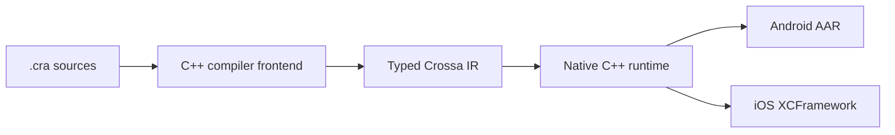
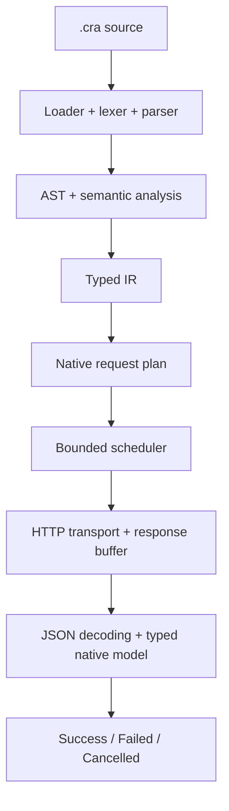
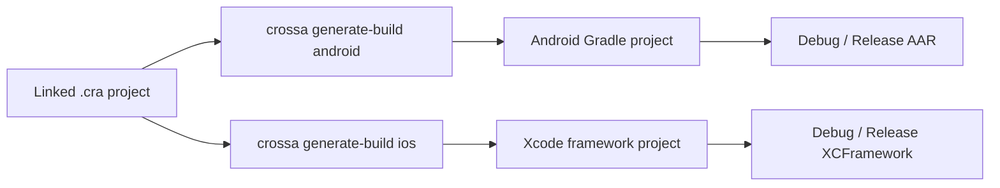

# Crossa

Crossa is a compiler and native runtime that turns `.cra` sources into Android and iOS APIs.

Describe models, functions, and HTTP requests once. A single C++ frontend compiles them to typed IR. The same native runtime executes the work — networking, scheduling, decoding, and memory — and generated Kotlin and Swift APIs expose it as an AAR or XCFramework.

> **Foundation phase.** The C++ frontend, typed IR, native HTTP/JSON runtime, Android AAR generation, iOS XCFramework generation, and CLI are available. Streaming delivery to platform APIs and generated direct decoders are still in progress.

## Crossa in one minute



- `.cra` is a small typed language for models, functions, and requests — not a general-purpose language.
- C++ is the only compiler frontend. It owns execution, networking, scheduling, and memory.
- Kotlin and Swift are thin integration surfaces. Crossa does not emit Retrofit, Ktor, Alamofire, or URLSession clients.

## Get started

1. Install Crossa using the [installation instructions](#installation).
2. Create a file named `hello.cra`:

```cra
fun add(a: Int, b: Int): Int {
    re a + b
}

print(add(1, 2))
```

3. Run it:

```sh
crossa run hello.cra
```

Output:

```text
3
```

Validate source without executing functions or requests:

```sh
crossa check hello.cra
```

In a terminal, `crossa` with no arguments opens the interactive wizard.

## A networking example

```cra
model User(
    id: Int,
    name: String
)

@AsyncAfter
fun getUser(id: Int): User {
    re CrossaRequest {
        url: "https://api.example.com/users/#id",
        method: GET
    }
}
```

`User` is the logical success type. With `@AsyncAfter`, the terminal result is one of:

```text
Success(User)
Failed(CrossaError)
Cancelled
```

The native runtime plans the request, executes it over HTTP, decodes JSON into `User`, and delivers that terminal state through the generated platform API.

A complete imported example lives at `examples/imports/runPosts.cra`.

## How a request moves through Crossa



The CLI, Android, and iOS share this path. Kotlin and Swift do not parse `.cra` and do not implement a second HTTP runtime.

## Why Crossa?

| Instead of | Crossa |
|---|---|
| Repeating models and parsers on every platform | One typed `.cra` definition |
| Divergent Android and iOS networking stacks | One shared native runtime |
| Extra copies across native and managed heaps | Native-backed results where practical |
| A different client implementation per request | One frontend, one IR, one execution path |
| Manual SDK scaffolding for each app | Generated AAR and XCFramework artifacts |

## What is available today?

| Area | Status |
|---|---|
| `.cra` loading, imports, lexer, parser, semantic analysis, and IR | Available |
| Variables, functions, models, `List<T>`, interpolation, `print`, and `assert` | Available |
| `CrossaRequest` with URL, path, query, headers, body, and HTTP methods | Available |
| JSON decoding for scalars, models, and lists | Available |
| Native scheduler, structured errors, and cancellation | Available |
| Kotlin generation | Available for pure translated IR |
| Android Gradle project and AAR generation | Available for `arm64-v8a` |
| iOS Debug/Release XCFramework generation | Available with Xcode and CMake |
| Streaming delivery to platform APIs and generated direct decoders | In progress |

## Installation

<details>
<summary>Expand installation instructions</summary>

The installers download a compiled binary from GitHub Releases and verify it with `SHA256SUMS`. They do not clone this repository, require `sudo`, or edit shell profile files.

### macOS ARM64 and Linux x86_64

```sh
curl -fsSL https://raw.githubusercontent.com/crossa-script/Crossa/main/scripts/install/install.sh | bash
```

To install a specific version:

```sh
curl -fsSL https://raw.githubusercontent.com/crossa-script/Crossa/main/scripts/install/install.sh | bash -s -- 0.1.0
```

### Windows x86_64

To install the latest version:

```powershell
irm https://raw.githubusercontent.com/crossa-script/Crossa/main/scripts/install/install.ps1 | iex
```

To install a specific version:

```powershell
Invoke-WebRequest https://raw.githubusercontent.com/crossa-script/Crossa/main/scripts/install/install.ps1 -OutFile install.ps1
.\install.ps1 -Version 0.1.0
```

### Installation location

```text
macOS / Linux: ~/.crossa/bin/crossa
Windows:       %USERPROFILE%\.crossa\bin\crossa.exe
```

Set `CROSSA_HOME` before running the installer to use a different location. If the Crossa bin directory is not already on `PATH`, the installer prints the exact command to add it.

### Supported release hosts

| Operating system | Architecture | Release asset |
|---|---|---|
| macOS | ARM64 / Apple Silicon | `crossa-vX.Y.Z-macos-arm64.tar.gz` |
| Linux | x86_64 | `crossa-vX.Y.Z-linux-x86_64.tar.gz` |
| Windows | x86_64 | `crossa-vX.Y.Z-windows-x86_64.zip` |

</details>

## Verify the installation

```sh
crossa --version
crossa doctor
```

`crossa doctor` inspects the Crossa installation and any Android or iOS toolchains on the machine. It does not install dependencies or modify environment variables.

## Platform outputs



| Command | Output |
|---|---|
| `crossa generate kotlin` | Kotlin source for pure translated IR |
| `crossa generate-build android` | Android Gradle library project for AAR assembly |
| `crossa generate-build ios` | Xcode project and Debug/Release XCFrameworks |

## Project documentation

**Language and architecture**

- [Technical Architecture](ARCHITECTURE.md) — system boundaries, ownership, and engineering rules.
- [Language Foundation](docs/language/language-foundation.md) — current `.cra` syntax and semantics.
- [Language Roadmap](docs/language/language-roadmap.md) — implementation order and future milestones.
- [Native Networking](docs/features/networking.md) — request fields, response decoding, and limits.

**Platforms**

- [Android AAR Generation](docs/platform/android.md) — generated Android projects and build requirements.
- [iOS XCFramework](docs/platform/ios.md) — XCFramework generation and Xcode integration.

**Development**

- [Crossa CLI](docs/development/cli.md) — commands, `doctor`, and interactive mode.
- [Testing](docs/development/testing.md) — test layers and fixtures.

<details>
<summary>Expand the full CLI reference</summary>

With stdin attached to a terminal, `crossa` with no arguments opens an interactive wizard. It collects a project root, source, and Android or iOS generation settings, prints the equivalent explicit command, then runs it. Enter accepts the displayed default; `0` goes back; `0` at the root exits. Non-TTY invocations never wait for input. `--no-input` makes that policy explicit.

| Command | Purpose |
|---|---|
| `crossa <file.cra>` | Shortcut for `crossa run <file.cra>` |
| `crossa run <file.cra>` | Execute reachable top-level calls |
| `crossa check <file.cra>` | Validate source, imports, semantics, and IR without execution |
| `crossa test <file.cra>` | Run a source file with assertions |
| `crossa generate kotlin <file.cra> --output <dir>` | Generate Kotlin for pure IR |
| `crossa generate-build android <project> --output <dir>` | Generate an Android Gradle project |
| `crossa generate-build ios <project> --output <dir>` | Generate and build XCFrameworks |
| `crossa doctor` | Check the local toolchain |
| `crossa --version` | Print the installed version |

### Examples

```sh
crossa run examples/imports/runPosts.cra
crossa check examples/imports/runPosts.cra
crossa test tests/test-runner/pass.cra
crossa generate kotlin tests/kotlin-generator/Math.cra --output ./generated
crossa generate-build android ./crossa-project --output ./build/crossa-aar
crossa generate-build ios ./crossa-project --output ./build/crossa-xcframework
```

Show compiler and IR details during execution:

```sh
crossa run --debug test.cra
```

Android build tool versions can be overridden for one generated project:

```sh
crossa generate-build android ./crossa-project --output ./build/crossa-aar \
  --ndk-version 28.1.13356709 \
  --gradle-version 8.11.1 \
  --kotlin-version 2.1.10
```

</details>

<details>
<summary>Expand source-build and development instructions</summary>

Basic requirements are CMake, Ninja, a C++20 compiler, and libcurl. Android and iOS generation also requires the relevant platform toolchain.

```sh
cmake -S . -B build -G Ninja -DCMAKE_BUILD_TYPE=Debug
cmake --build build
./build/crossa run test.cra
```

Run the complete local test suite:

```sh
./test.sh
```

JSONPlaceholder integration tests are optional because they require external network access:

```sh
CROSSA_RUN_NETWORK_INTEGRATION=1 ./test.sh
```

Architecture, ABI, IR, ownership, scheduler, transport, module-boundary, and major dependency changes require an ADR under `docs/decisions/`.

</details>

## License

Crossa is available under the [Apache License 2.0](LICENSE).
